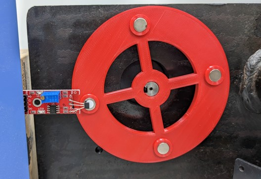

# hall-digit

Project on Arduino Uno.

Calculate angular velocity and acceleration from the digital signal of Hall sensor by applying Exponential Moving Average (EMA) filter on the velocity data. The experimental factor is 0.92. (compared to a digital photo tachometer 0.04% ±2dgts in rpm)

**The positive and negative poles are arranged alternately.**

